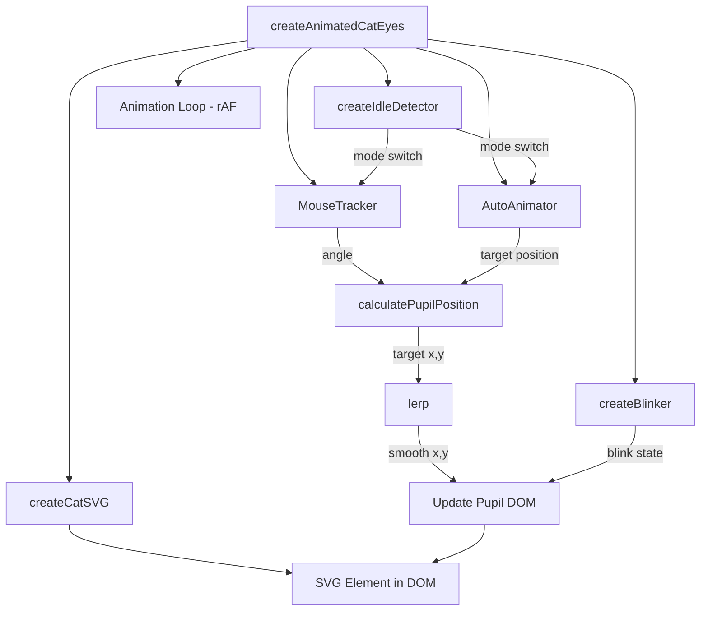

# Dokumen Desain: Animated Cat Eyes

## Gambaran Umum

Animated Cat Eyes adalah komponen UI interaktif berbasis JavaScript murni yang merender ilustrasi kucing dengan mata yang bergerak dinamis. Mata kucing mengikuti posisi kursor mouse pengguna, atau bergerak secara otomatis saat tidak ada interaksi. Komponen ini diimplementasikan sebagai modul JavaScript tunggal yang dapat diintegrasikan ke halaman HTML manapun tanpa dependensi eksternal.

Komponen ini terdiri dari beberapa sub-modul yang bekerja bersama:
- Rendering SVG untuk ilustrasi kucing
- Mouse Tracker untuk mendeteksi posisi kursor
- Auto Animator untuk gerakan idle otomatis
- Idle Detector untuk mengelola transisi antar mode
- Blinker untuk animasi kedipan
- Loop animasi utama dengan interpolasi linear (lerp)

## Arsitektur



Alur data utama:
1. Event `mousemove` → MouseTracker → sudut → `calculatePupilPosition` → posisi target
2. Idle timeout → AutoAnimator → posisi target
3. Setiap frame rAF: posisi target → `lerp` → posisi pupil aktual → update DOM SVG
4. Timer acak → Blinker → animasi buka/tutup kelopak mata

## Komponen dan Antarmuka

### `createCatSVG(config)`
Merender elemen SVG kucing ke dalam container.

```js
// config: { width, height, bodyColor }
// returns: { svgEl, leftEye, rightEye }
// leftEye/rightEye: { socket, pupil, centerX, centerY, radius }
```

### `createEyes(svgEl, config)`
Menambahkan dua Eye simetris ke elemen SVG.

```js
// config: { width, height, pupilColor }
// returns: { leftEye, rightEye }
```

### `MouseTracker`
Modul yang melacak posisi kursor mouse.

```js
const tracker = MouseTracker();
tracker.start();
tracker.stop();
const angle = tracker.getAngle(eyeCenterX, eyeCenterY); // returns radians
```

### `calculatePupilPosition(angle, maxRadius)`
Menghitung posisi pupil berdasarkan sudut dan radius maksimal.

```js
// returns: { x, y } — selalu dalam lingkaran radius maxRadius
```

### `AutoAnimator`
Menghasilkan posisi target otomatis menggunakan fungsi sinusoidal.

```js
const animator = AutoAnimator();
animator.start();
animator.stop();
const pos = animator.getTargetPosition(eyeCenter, maxRadius, timestamp);
// returns: { x, y }
```

### `createIdleDetector(idleTimeout, onIdle, onActive)`
Mengelola transisi antara mode mouse-tracking dan mode idle.

```js
// idleTimeout: ms
// onIdle: () => void — dipanggil saat idle
// onActive: () => void — dipanggil saat mouse aktif kembali
// returns: { start(), stop() }
```

### `lerp(current, target, factor)`
Interpolasi linear antara dua nilai.

```js
// current: number, target: number, factor: number (0.1–0.3)
// returns: number antara current dan target
```

### `createBlinker(eyeElements, onBlinkStart, onBlinkEnd)`
Mengelola siklus animasi kedipan.

```js
// eyeElements: { leftEye, rightEye }
// onBlinkStart/onBlinkEnd: () => void
// returns: { start(), stop() }
```

### `createAnimatedCatEyes(container, config)`
Fungsi factory utama yang menyatukan semua modul.

```js
// config: { width?, height?, bodyColor?, pupilColor?, idleTimeout? }
// returns: { destroy() }
```

## Model Data

### Config
```js
{
  width: 200,          // piksel, default 200
  height: 200,         // piksel, default 200
  bodyColor: '#F4A460', // warna tubuh kucing
  pupilColor: '#1a1a1a', // warna pupil
  idleTimeout: 3000,   // ms sebelum mode idle aktif
  lerpFactor: 0.15,    // faktor interpolasi (0.1–0.3)
  blinkMinInterval: 2000, // ms
  blinkMaxInterval: 6000  // ms
}
```

### EyeState
```js
{
  centerX: number,   // koordinat pusat soket mata dalam SVG
  centerY: number,
  radius: number,    // radius soket mata
  maxPupilRadius: number, // 40% dari diameter = 0.4 * radius * 2
  currentX: number,  // posisi pupil saat ini (setelah lerp)
  currentY: number,
  targetX: number,   // posisi target pupil
  targetY: number,
  isBlinking: boolean
}
```

### AnimationState
```js
{
  mode: 'mouse' | 'idle', // mode aktif saat ini
  isRunning: boolean,
  lastMouseX: number,
  lastMouseY: number,
  lastMouseTime: number
}
```

## Correctness Properties

*A property is a characteristic or behavior that should hold true across all valid executions of a system — essentially, a formal statement about what the system should do. Properties serve as the bridge between human-readable specifications and machine-verifiable correctness guarantees.*

### Property 1: Posisi pupil selalu dalam radius maksimal

*For any* sudut (angle) dan radius maksimal (maxRadius), hasil `calculatePupilPosition(angle, maxRadius)` harus menghasilkan posisi `{x, y}` di mana `sqrt(x² + y²) <= maxRadius`.

**Validates: Requirements 2.2, 3.4**

---

### Property 2: Posisi auto-animator selalu dalam radius maksimal

*For any* timestamp, eye center, dan maxRadius, hasil `AutoAnimator.getTargetPosition(eyeCenter, maxRadius, timestamp)` harus menghasilkan posisi di mana jarak dari `eyeCenter` tidak melebihi `maxRadius`.

**Validates: Requirements 3.2, 3.4**

---

### Property 3: Lerp selalu menghasilkan nilai antara current dan target

*For any* nilai `current`, `target`, dan `factor` dalam rentang [0.1, 0.3], hasil `lerp(current, target, factor)` harus berada di antara `current` dan `target` (inklusif).

**Validates: Requirements 5.1**

---

### Property 4: Interval kedipan selalu dalam rentang yang valid

*For any* panggilan ke fungsi penjadwal kedipan, interval yang dihasilkan harus berada antara 2000ms dan 6000ms (inklusif).

**Validates: Requirements 4.1**

---

### Property 5: Posisi pupil tidak berubah selama kedipan

*For any* state pupil sebelum kedipan dimulai, posisi pupil `{x, y}` harus tetap sama selama animasi kedipan berlangsung (dari `onBlinkStart` hingga `onBlinkEnd`).

**Validates: Requirements 4.3**

---

### Property 6: Eye simetris untuk semua ukuran komponen

*For any* konfigurasi lebar dan tinggi yang valid, posisi `leftEye.centerX` dan `rightEye.centerX` harus simetris terhadap sumbu tengah horizontal SVG (yaitu `leftEye.centerX + rightEye.centerX === width`).

**Validates: Requirements 1.2**

## Penanganan Error

- **Container tidak ditemukan**: `createAnimatedCatEyes` melempar `Error` jika `container` adalah `null` atau bukan elemen DOM.
- **Config tidak valid**: Nilai negatif atau nol untuk `width`/`height` akan di-clamp ke nilai default. Nilai `lerpFactor` di luar [0, 1] akan di-clamp ke [0.1, 0.3].
- **requestAnimationFrame tidak tersedia**: Fallback otomatis ke `setTimeout(fn, 16)`.
- **Mouse keluar dari halaman**: Event `mouseleave` pada `document` menyebabkan MouseTracker mempertahankan posisi terakhir yang valid tanpa update lebih lanjut.
- **Destroy dipanggil sebelum start**: Method `destroy()` aman dipanggil kapan saja; membersihkan semua listener dan timer yang aktif.

## Strategi Pengujian

### Pendekatan Dual Testing

Pengujian menggunakan dua pendekatan yang saling melengkapi:
- **Unit test**: Memverifikasi contoh spesifik, kondisi tepi, dan integrasi antar modul
- **Property test**: Memverifikasi properti universal yang harus berlaku untuk semua input valid

### Unit Tests

Fokus pada:
- Rendering SVG menghasilkan elemen yang benar (kepala, telinga, mata, hidung, mulut)
- Konfigurasi default diterapkan dengan benar (200x200, `#F4A460`, `#1a1a1a`, 3000ms)
- Transisi idle: aktif → idle setelah timeout, idle → aktif saat mouse bergerak
- Durasi animasi kedipan: 150ms tutup + 150ms buka
- Fallback `setTimeout` saat `requestAnimationFrame` tidak tersedia
- Method `destroy()` membersihkan semua event listener dan timer

### Property Tests

Library yang digunakan: **fast-check** (JavaScript)

Setiap property test dikonfigurasi dengan minimum **100 iterasi**.

Setiap test diberi tag komentar dengan format:
`// Feature: animated-cat-eyes, Property {N}: {deskripsi singkat}`

| Property | Test | Keterangan |
|---|---|---|
| Property 1 | `calculatePupilPosition` radius constraint | Generate angle acak [0, 2π] dan maxRadius acak [1, 100] |
| Property 2 | `AutoAnimator` radius constraint | Generate timestamp dan maxRadius acak |
| Property 3 | `lerp` bounds | Generate current, target acak, factor dalam [0.1, 0.3] |
| Property 4 | Blink interval range | Generate banyak interval, verifikasi semua dalam [2000, 6000] |
| Property 5 | Pupil position invariant during blink | Generate posisi pupil acak, trigger blink, verifikasi tidak berubah |
| Property 6 | Eye symmetry | Generate width/height acak dalam [320, 1920], verifikasi simetri |

### Contoh Konfigurasi Property Test (fast-check)

```js
import fc from 'fast-check';
import { calculatePupilPosition } from './animated-cat-eyes.js';

// Feature: animated-cat-eyes, Property 1: posisi pupil selalu dalam radius maksimal
test('calculatePupilPosition selalu dalam radius maksimal', () => {
  fc.assert(
    fc.property(
      fc.float({ min: 0, max: Math.PI * 2 }),
      fc.float({ min: 1, max: 100 }),
      (angle, maxRadius) => {
        const { x, y } = calculatePupilPosition(angle, maxRadius);
        return Math.sqrt(x * x + y * y) <= maxRadius + 1e-9;
      }
    ),
    { numRuns: 100 }
  );
});
```
